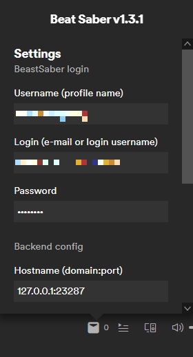

# spicetify-beat-saber-backend
Python backend for spicetify-beat-saber extension

## Description
This is a background service to enable [spicetify-beat-saber](https://github.com/kuba2k2/spicetify-beat-saber) download maps or bookmark them on BeastSaber.

## Installation
Run the .msi file downloadable on the Releases page. The app is added to autorun automatically.

Don't run the app before following `Configuration` steps below, otherwise it will not work.

## Configuration
1. Create a `.beatsaber.env` file in your `.spicetify` directory (which is in your home dir/user profile).

```properties
AUTH_USERNAME=admin
AUTH_PASSWORD=nimda
BEATSABER_DIR=c:\Oculus\Beat Saber\
APP_HOST=127.0.0.1
APP_PORT=23287
```

2. Change `AUTH_USERNAME` and `AUTH_PASSWORD` to suit your needs.

3. Set `BEATSABER_DIR` to the full path of your game directory.

4. Either run the app directly (`c:\Program Files\kubasz\spicetify-beat-saber-backend\spicetify-beat-saber-backend.exe`) or reboot your PC, which should start it too.

Then, configure the settings in the beat-saber custom app in Spotify:
- BeastSaber login data - required to use the bookmarking feature
  - `Username` is your BeastSaber public profile name (as in https://bsaber.com/members/profile-name-goes-here/)
  - `Login` is your e-mail address or login name that allows to login to BeastSaber
  - `Password` is pretty self-explanatory
- backend access info - required to use either bookmarking or downloading
  - `Hostname` is the `APP_HOST` and `APP_PORT`, concatenated with a colon
  - `Authentication` is the `AUTH_USERNAME` and `AUTH_PASSWORD`, concatenated with a colon AND Base64-encoded (i.e. user `admin` password `nimda` becomes `YWRtaW46bmltZGE=`)



After configuring these settings, the plugin should be fully functional.

## License
MIT
